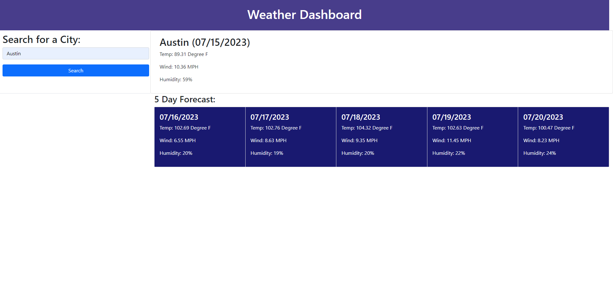

# <weather-api>

## Description

I created this weather api to help me track the weather in different cities. Building this project was a good exorcize in using Web APIs with a real world application. This weather api will be useful to see the weather forecast for today, and for the next 5 days. This project helped me learn how to use Web APIs, and how to better use Bootstrap.

## Usage

This program will provide great everyday usage to users wanting to see what the weather will be in certain cities.

## Credits

Fetch API: https://www.w3schools.com/jsref/api_fetch.asp

Dayjs: https://day.js.org/

jQuery: https://jqueryui.com/

Bootstrap: https://getbootstrap.com/docs/5.0/getting-started/introduction/

## License

Please refer to the LICENSE in the repo.